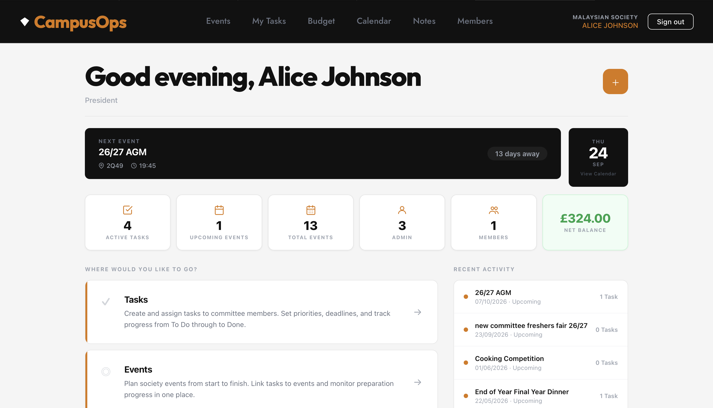
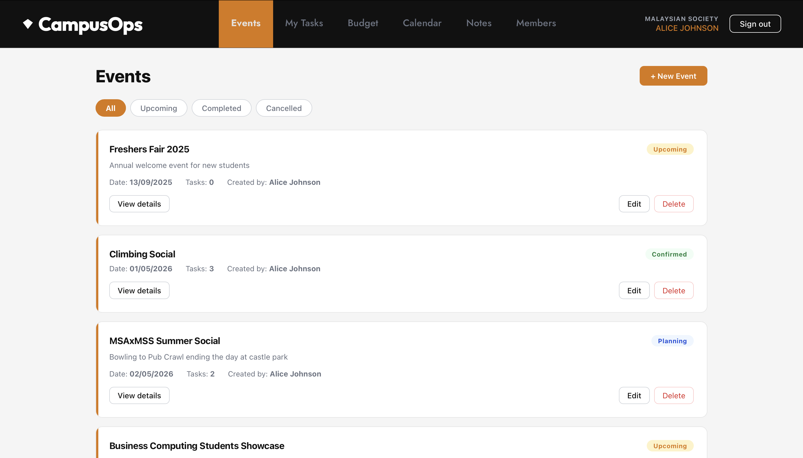
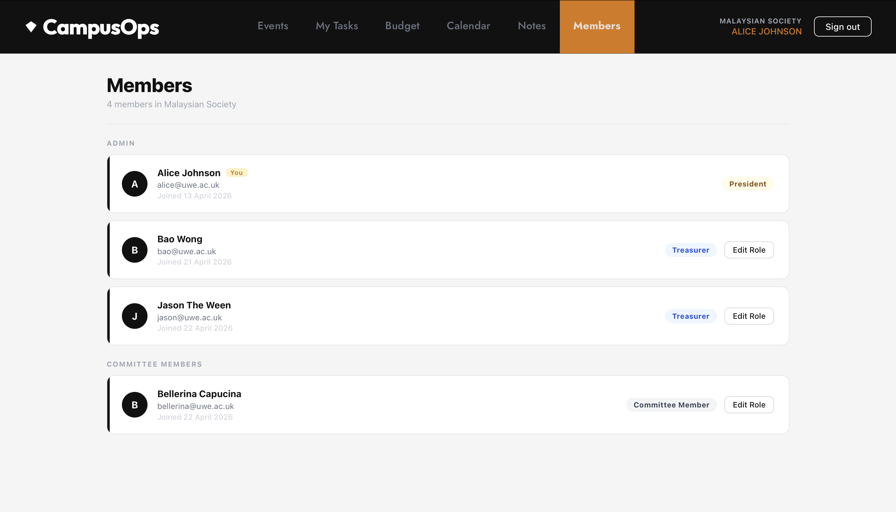
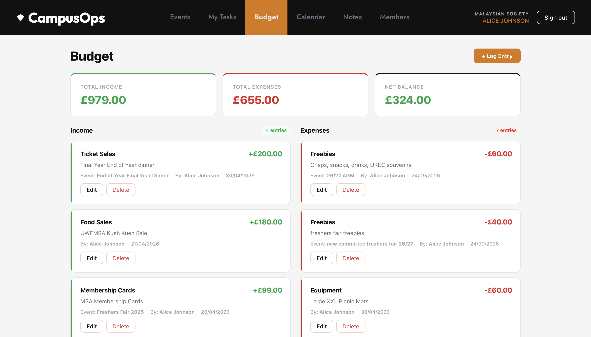
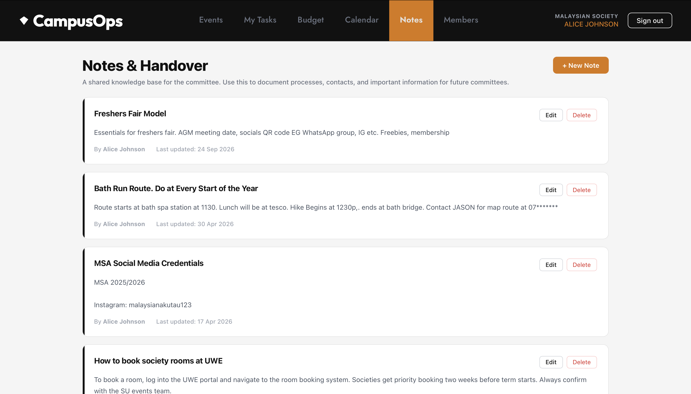
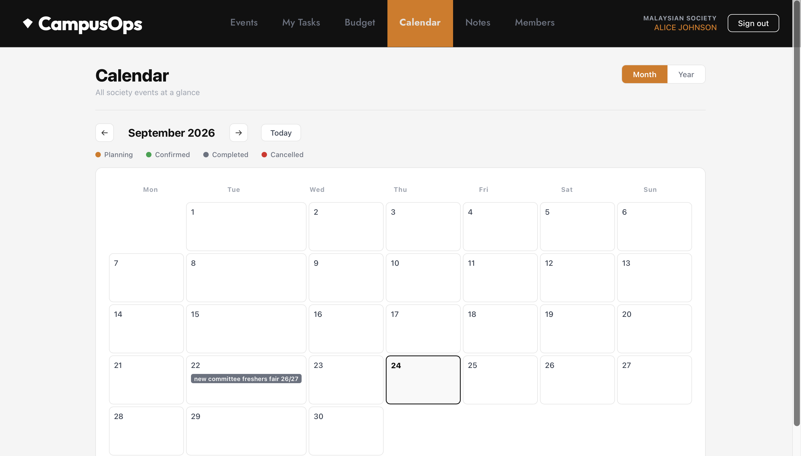

# CampusOps

Operations management platform for university student societies, built with React, Node.js/Express and MySQL.

Committees running student societies often rely on scattered WhatsApp messages, spreadsheets and Google Forms to plan events, assign tasks and track budgets. CampusOps centralises this into one workspace with role-based access, so a President, Treasurer and Committee Members each see and can do only what's appropriate for their role.

## Screenshots

**Dashboard**


**Events**


**Members & roles**


**Budget**


**Notes & handover**


**Calendar**


## Features

- Authentication with JWT, and role-based access control (President, Treasurer, Committee Member) enforced at the API level, not just hidden in the UI
- Event planning with statuses (Planning/Confirmed/Completed/Cancelled), linked tasks, and cascading deletion that safely unlinks rather than orphans data
- Task management with priorities, deadlines, comments, and per-user visibility (each member sees only their own assigned tasks)
- Budget tracking with income/expense entries linked to specific events, and live totals
- Society-wide notes and handover documentation
- Calendar view of all events by month

## Tech stack

- Frontend: React
- Backend: Node.js, Express
- Database: MySQL
- Auth: JWT, bcrypt

## Setup

### 1. Database

Create a MySQL database (for example `campusops`) and import `database/schema.sql`.

### 2. Backend

```
cd campusops-backend
npm install
cp .env.example .env
```

Open `.env` and fill in your database details and a JWT secret. Then start the server:

```
npm start
```

### 3. Frontend

In a second terminal:

```
cd campusops-frontend
npm install
npm start
```

## Status

Core features (auth, events, tasks, budget, notes, calendar, member roles) are built and manually tested, including verifying that role-based permissions are enforced server-side, not just hidden in the UI, by calling the API directly with different user roles.

**Known limitations:**
- Event status is set at creation and doesn't automatically update once an event's date passes, so the dashboard's "Upcoming Events" count can diverge from what's shown as "Upcoming" on the Events page.
- No automated test suite yet.
- Not yet deployed; runs locally only.

**Planned next:**
- Automated backend tests (Jest/Supertest)
- CI pipeline
- Live deployment
- Document upload support within Notes